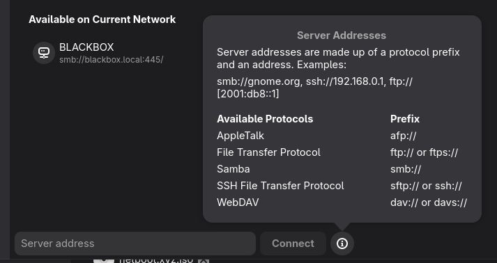

# File Sharing

A quick way to share files

```sh
# no authentication
oc apply -k https://github.com/redhat-na-ssa/demo-ai-gitops-catalog/components/app-configs/webdav/overlays/default

# with authentication
oc apply -k https://github.com/redhat-na-ssa/demo-ai-gitops-catalog/components/app-configs/webdav/overlays/basic-auth
```

In Gnome Files / Network use `dav://URL` or `davs://URL`


